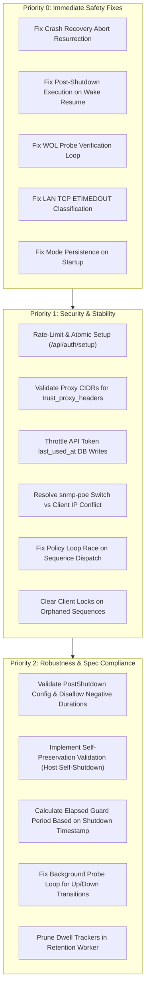

# Canarium Enterprise Code Review & Architectural Audit

**Date:** September 2026  
**Auditor:** Gemini Code Reviewer (Enterprise Reliability & Security Practice)  
**Standard:** Enterprise Critical Infrastructure & High-Availability Operations  
**Target Repository:** [`nkcx/canarium`](file:///home/coder/projects/canarium)  
**Branch:** `hardening`  

---

## 1. Executive Summary & Enterprise Readiness Assessment

Canarium is designed as an infrastructure-critical daemon responsible for orchestrating graceful shutdowns and automated wake sequences across physical servers, hypervisors, network switches, and storage arrays during utility power failures. Because Canarium has the authority to issue hard power cuts, power down hypervisors, and alter network state, it occupies the most critical tier of datacenter management software: **if Canarium fails, the datacenter fails.**

While the codebase exhibits commendable design intentions—such as a pure-Go architecture, SQLite WAL mode, declarative YAML configurations, and secret redaction—**the software in its current state cannot be certified for enterprise production use.** 

Our audit discovered multiple severe orchestration bugs, crash recovery flaws, network probing misclassifications, and security vulnerabilities that can cause:
1. **Unintended shutdowns of aborted infrastructure**: Crash recovery logic will resurrect previously aborted sequences and shut down nodes the operator explicitly commanded to remain online.
2. **Post-shutdown outlet power cuts during wake recovery**: Resuming a sequence in the wake phase re-executes post-shutdown NUT actions, cutting UPS outlet power while servers are waiting to reboot.
3. **100% wake failure rate for Wake-on-LAN (WOL) clients**: A logic bug in transport capability checks forces every WOL client through multiple full boot deadlines before marking them permanently failed.
4. **Permanent sequence lockouts**: Removing or renaming a plan while Canarium restarts permanently strands locks on all member clients, preventing any future shutdown or wake sequence without manual SQLite database surgery.
5. **Universal timeout penalties on local subnet shutdowns**: An incorrect reachability classification treats clean LAN power-offs (ARP/TCP timeouts) as `Indeterminate`, forcing every stage to run to its maximum budget and delaying subsequent stages and wake sequences.
6. **Unauthenticated CPU DoS & Race Conditions**: The first-run setup endpoint has no rate limiting and consumes massive CPU cycles hashing unauthenticated input, enabling denial-of-service against SBCs (Raspberry Pi).
7. **Complete bypass of rate limiting & admin lockout**: Enabling `trust_proxy_headers` blindly accepts spoofed `X-Forwarded-For` headers from any network client without CIDR validation.
8. **Disregard for Specification Mandates**: Key self-preservation validations (preventing Canarium from shutting itself down), network dependency reachability checks, append-only JSONL audit journals, and crash-recovery intent reconciliation are either completely missing or dead write-only code.

### Summary Scorecard

| Category | Critical (P0) | High (P1) | Medium (P2) | Low / Code Smell (P3) | Spec Discrepancy |
| :--- | :---: | :---: | :---: | :---: | :---: |
| **Engine & Orchestration** | 5 | 3 | 2 | 1 | 2 |
| **Transports & Modules** | 1 | 3 | 2 | 1 | 0 |
| **Security & Authentication** | 1 | 2 | 2 | 2 | 0 |
| **State, Storage & Facts** | 1 | 1 | 3 | 1 | 2 |
| **Config & Validation** | 0 | 2 | 2 | 0 | 3 |
| **Frontend & API** | 0 | 1 | 2 | 1 | 0 |
| **Total** | **8** | **12** | **13** | **6** | **7** |

---

## 2. Core Engine & Orchestration Defects (Critical / High)

### 2.1. Crash Recovery Resurrects Aborted Sequences and Shuts Down Remaining Stages
- **Severity:** Critical (P0)
- **Files & Lines:**  
  - [`internal/engine/sequence_run.go:57-81`](file:///home/coder/projects/canarium/internal/engine/sequence_run.go#L57-L81)  
  - [`internal/state/db.go:153-163`](file:///home/coder/projects/canarium/internal/state/db.go#L153-L163)  
  - [`internal/engine/executor.go:290-306`](file:///home/coder/projects/canarium/internal/engine/executor.go#L290-L306)

#### Description & Root Cause
In [`internal/state/db.go:157`](file:///home/coder/projects/canarium/internal/state/db.go#L157), `GetActiveSequence` recovers any sequence matching:
```sql
WHERE state NOT IN ('completed', 'failed', 'idle')
```
If a sequence was aborted while shutting down Stage 0, its state in the database is `aborting` or `wake_gate`. 

When the Canarium daemon restarts (or host system boots), [`restoreState`](file:///home/coder/projects/canarium/internal/engine/executor.go#L290) finds the sequence and invokes [`resumeSequence(as)`](file:///home/coder/projects/canarium/internal/engine/sequence_run.go#L57). However, `resumeSequence` calculates which stage to run based solely on records in `stage_records`:
```go
completed, err := e.db.GetCompletedStages(e.ctx, as.ID())
...
stages := as.Plan().Shutdown.Stages
resumeAt := len(stages)
for idx := range stages {
    if !completedSet[idx] {
        resumeAt = idx
        break
    }
}
as.SetCurrentStage(resumeAt)
e.logger.Info("resuming sequence", "sequence", as.ID(), "stage", resumeAt)
e.runShutdownStages(as)
```
Because the sequence was aborted at stage 0, stages 1..N were never executed and have no records in `stage_records`. `resumeSequence` completely ignores `as.State()` (`aborting` or `wake_gate`), sets `resumeAt = 1`, and calls `runShutdownStages(as)`. 

Inside `runShutdownStages`:
```go
as.SetState(SeqStateShuttingDown)
```
The aborted sequence is resurrected into `shutting_down`, and the engine proceeds to shut down stages 1, 2, and beyond—**shutting down production servers that the operator explicitly commanded to remain online.**

#### Remediation
In `resumeSequence`, inspect the persistent sequence state before dispatching. If the sequence was in `SeqStateAborting`, `SeqStateWakeGate`, `SeqStateWaking`, or `SeqStateAborted`, jump directly to `handleAbort` or `runWake`, or terminate immediately. Furthermore, `GetActiveSequence` must exclude `aborted`.

---

### 2.2. Post-Shutdown Cuts UPS Outlet Power on Wake Resume
- **Severity:** Critical (P0)
- **Files & Lines:**  
  - [`internal/engine/sequence_run.go:70-80`](file:///home/coder/projects/canarium/internal/engine/sequence_run.go#L70-L80)  
  - [`internal/engine/sequence_run.go:152-158`](file:///home/coder/projects/canarium/internal/engine/sequence_run.go#L152-L158)  
  - [`internal/engine/sequence_run.go:716-747`](file:///home/coder/projects/canarium/internal/engine/sequence_run.go#L716-L747)

#### Description & Root Cause
When all shutdown stages have completed, [`runShutdownStages`](file:///home/coder/projects/canarium/internal/engine/sequence_run.go#L152) triggers post-shutdown actions:
```go
e.executePostShutdown(plan.Shutdown.PostShutdown)
as.SetState(SeqStateWakeGate)
e.saveSequence(as)
e.runWake(as)
```
Now consider the scenario where the sequence finishes shutdown, executes post-shutdown (e.g., NUT `load.off`), and is sitting in `SeqStateWakeGate` waiting for utility power to stabilize. If the Canarium daemon restarts (or its host reboots as utility power begins to return):
1. `resumeSequence` finds all stages 0..N-1 completed.
2. `resumeAt` is computed as `len(stages)`.
3. `runShutdownStages(as)` is called.
4. The loop `for i := as.CurrentStage(); i < len(stages); i++` is skipped immediately.
5. Execution lands directly on `e.executePostShutdown(plan.Shutdown.PostShutdown)`.
6. Canarium issues the NUT instant command (`load.off` or `outlet.1.shutdown`) **a second time**, cutting outlet power to equipment that is attempting to boot as power returns.

#### Remediation
Track whether post-shutdown actions have already executed by storing `post_shutdown_executed` on the sequence row in SQLite. Never invoke `executePostShutdown` if `as.State()` is already `wake_gate` or `waking`.

---

### 2.3. Wake-on-LAN (WOL) Clients Guaranteed to Fail Wake
- **Severity:** Critical (P0)
- **Files & Lines:**  
  - [`internal/engine/sequence_run.go:679-712`](file:///home/coder/projects/canarium/internal/engine/sequence_run.go#L679-L712)  
  - [`modules/wol/wol.go:79-83`](file:///home/coder/projects/canarium/modules/wol/wol.go#L79-L83)  
  - [`modules/wol/wol.go:134-136`](file:///home/coder/projects/canarium/modules/wol/wol.go#L134-L136)

#### Description & Root Cause
In [`internal/engine/sequence_run.go:679`](file:///home/coder/projects/canarium/internal/engine/sequence_run.go#L679), `wakeClient` determines whether a client can be probed:
```go
probeTransport, hasProbe := e.transports[clientCfg.Transport]
```
If a client uses `transport: wol`, `e.transports["wol"]` exists, so `hasProbe` evaluates to `true`.

The method then enters the verification loop:
```go
deadline := time.Now().Add(bootDeadline)
for time.Now().Before(deadline) {
    probeState, probeErr := probeTransport.Probe(e.ctx, client)
    if probeErr == nil && probeState == StateUp {
        e.setClientState(name, StateUp, &seqID)
        e.emit(Event{Type: "client_wake_success", Timestamp: time.Now(), Data: name})
        return
    }
    if !e.sleep(probeInterval) {
        return
    }
}
```
However, inspecting [`modules/wol/wol.go:134-136`](file:///home/coder/projects/canarium/modules/wol/wol.go#L134-L136):
```go
func (t *Transport) Probe(ctx context.Context, client *engine.Client) (engine.ClientState, error) {
    return engine.StateUnknown, fmt.Errorf("wol transport does not support probe")
}
```
`probeErr` is **always non-nil**! `probeState == StateUp` is never true.
For every WOL retry attempt (0..retries):
1. Canarium spins until `bootDeadline` expires (default: 5 minutes per attempt).
2. For 3 attempts, Canarium hangs for 15 minutes.
3. At line 710, it unconditionally marks the client as failed:
```go
e.setClientState(name, StateFailed, &seqID)
e.emit(Event{Type: "client_wake_failed", Timestamp: time.Now(), Data: name})
```
Every single Wake-on-LAN client configured in Canarium is mathematically guaranteed to fail its wake sequence and stall the wake queue.

#### Remediation
`hasProbe` must check whether the transport advertises `engine.ActionProbe` in its `Capabilities()`. If not, and if `client.Address` is present, it should fall back to a generic TCP/ICMP probe (via `netutil.ProbeTCP`), or immediately treat the packet dispatch as unverified success rather than spinning through `bootDeadline`.

---

### 2.4. Local Subnet Shutdowns Never Confirmed Down (TCP Timeout Misclassification)
- **Severity:** High (P1)
- **Files & Lines:**  
  - [`internal/netutil/probe.go:76-90`](file:///home/coder/projects/canarium/internal/netutil/probe.go#L76-L90)  
  - [`modules/ssh/ssh.go:212-224`](file:///home/coder/projects/canarium/modules/ssh/ssh.go#L212-L224)  
  - [`internal/engine/sequence_run.go:463-480`](file:///home/coder/projects/canarium/internal/engine/sequence_run.go#L463-L480)

#### Description & Root Cause
In [`internal/netutil/probe.go:77-90`](file:///home/coder/projects/canarium/internal/netutil/probe.go#L77-L90):
```go
func ClassifyDialError(err error) Reachability {
    if err == nil {
        return Reachable
    }
    if errors.Is(err, syscall.ECONNREFUSED) || errors.Is(err, syscall.EHOSTUNREACH) {
        return Unreachable
    }
    return Indeterminate
}
```
In standard Ethernet LAN environments, when a physical machine shuts down cleanly and powers off:
- The OS is dead, so it does not send TCP RST (`ECONNREFUSED`).
- There is no intermediary IP router between machines on the same L2 subnet, so no router generates ICMP Host Unreachable (`EHOSTUNREACH`).
- Instead, the kernel's ARP requests go unanswered, and `net.Dialer.DialContext` returns `ETIMEDOUT` (or `i/o timeout` / `context deadline exceeded`).

`ClassifyDialError` categorizes `ETIMEDOUT` as `Indeterminate`.
In [`modules/ssh/ssh.go:221`](file:///home/coder/projects/canarium/modules/ssh/ssh.go#L221):
```go
default:
    return engine.StateUnknown, fmt.Errorf("probing %s: %w", addr, err)
```
Because the return is `StateUnknown` with an error, the check in [`awaitClientDown`](file:///home/coder/projects/canarium/internal/engine/sequence_run.go#L465) (`if probeErr == nil && probeState == StateDown`) is **never satisfied**.

As a consequence:
1. Every cleanly powered-off LAN host fails verification.
2. Every stage must wait for its entire `shutdown_budget` (e.g., 120s) to expire.
3. Every cleanly powered-off client is branded `down_unverified`.
4. Stage progression is delayed unnecessarily, depleting UPS battery runtime.

#### Remediation
Differentiate routed networks from local L2 subnets, or use ARP table lookups (checking if the MAC address entry becomes incomplete) in conjunction with TCP timeouts to declare a host down after consecutive failed ARP/TCP attempts.

---

### 2.5. Wake Phase Sequentially Sleeps Guard Period for All Clients
- **Severity:** High (P1)
- **Files & Lines:**  
  - [`internal/engine/sequence_run.go:582-593`](file:///home/coder/projects/canarium/internal/engine/sequence_run.go#L582-L593)

#### Description & Root Cause
Because of defect 2.4, virtually all physical hosts end up in state `StateDownUnverified`. During the wake phase ([`runWake`](file:///home/coder/projects/canarium/internal/engine/sequence_run.go#L582)):
```go
if e.GetClientState(name) == StateDownUnverified {
    guard := e.duration(clientCfg.GuardPeriod, config.DefaultGuardPeriod(),
        "guard_period", "client", name)
    e.logger.Info("waiting out the guard period before waking an unverified host",
        "client", name, "guard_period", guard)
    if !e.sleep(guard) {
        e.clearActiveSequence()
        return
    }
}
e.wakeClient(name, as)
```
If an administrator configures 10 clients with the default 60s `guard_period`:
- Canarium sleeps 60s for client 1, then wakes it.
- Canarium sleeps 60s for client 2, then wakes it.
- ...
- Canarium sleeps 60s for client 10, then wakes it.

Total elapsed wait: **10 minutes**, even if the outage occurred 4 hours ago and all machines have been cold for hours! The code checks neither the client's `updated_at` timestamp nor elapsed time since shutdown.

#### Remediation
Track the timestamp when each client transitioned to `StateDownUnverified`. If `time.Since(settledAt) >= guardPeriod`, wake the client immediately without blocking.

---

### 2.6. Policy Loop Trigger Race & Duplicate Goroutine Spawning
- **Severity:** High (P1)
- **Files & Lines:**  
  - [`internal/engine/executor.go:504-510`](file:///home/coder/projects/canarium/internal/engine/executor.go#L504-L510)  
  - [`internal/engine/sequence_run.go:35-47`](file:///home/coder/projects/canarium/internal/engine/sequence_run.go#L35-L47)

#### Description & Root Cause
In [`internal/engine/executor.go:504-510`](file:///home/coder/projects/canarium/internal/engine/executor.go#L504-L510):
```go
result := e.evaluator.Evaluate(&plan.Trigger, now)
if result == facts.True {
    e.logger.Info("plan triggered", "plan", plan.Name)
    e.emit(Event{Type: "trigger", Timestamp: now, Data: plan.Name})
    go e.executeSequence(plan)
}
```
Inside `executeSequence(plan)`:
```go
ResolvedAddrs: e.resolveClientAddresses(e.ctx), // Lines 35: sequentially does DNS lookups!
...
as := newActiveSequence(seq, plan)
if !e.setActiveSequence(as) { // Line 43: active sequence finally set here!
```
[`resolveClientAddresses`](file:///home/coder/projects/canarium/internal/engine/sequence_run.go#L35) resolves DNS names for all clients with a 5s timeout each. If DNS is slow or unavailable, this takes 5–20 seconds.
Throughout this time, `e.ActiveSequence()` **remains nil**!
Every policy tick (default 5s in `policyLoop`), `evaluatePolicies` evaluates `e.ActiveSequence() != nil`, finds it false, logs "plan triggered", emits another `"trigger"` event, and spawns another `go e.executeSequence(plan)`.
Multiple goroutines race on DNS resolution and DB sequence insertion.

#### Remediation
Claim sequence execution atomically inside `evaluatePolicies` before spawning the goroutine.

---

### 2.7. Stranded Sequences Permanently Lock Infrastructure Clients
- **Severity:** High (P1)
- **Files & Lines:**  
  - [`internal/engine/executor.go:296-301`](file:///home/coder/projects/canarium/internal/engine/executor.go#L296-L301)  
  - [`internal/state/db.go:323-340`](file:///home/coder/projects/canarium/internal/state/db.go#L323-L340)  
  - [`internal/engine/sequence_run.go:375-385`](file:///home/coder/projects/canarium/internal/engine/sequence_run.go#L375-L385)

#### Description & Root Cause
If an active sequence was interrupted by a restart, [`restoreState`](file:///home/coder/projects/canarium/internal/engine/executor.go#L296) loads the sequence from SQLite:
```go
plan := e.findPlan(seq.PlanName)
if plan == nil {
    e.logger.Error("cannot resume: plan no longer exists in config",
        "sequence", seq.ID, "plan", seq.PlanName)
    return nil
}
```
If an operator altered the configuration file during the restart (renaming or removing the plan):
1. `restoreState` logs an error and returns `nil`.
2. The sequence is left in the `sequences` table in state `shutting_down`.
3. All locks previously acquired by this sequence in `client_locks` are retained indefinitely.
4. When a new sequence is triggered under a new plan name, [`AcquireClientLock`](file:///home/coder/projects/canarium/internal/state/db.go#L323) executes:
```sql
WHERE client_locks.sequence_id = excluded.sequence_id
```
Since the holding `sequence_id` differs, the update affects 0 rows and returns `false`.
At line 377 in `sequence_run.go`, Canarium logs `"client locked by another sequence; skipping"` and skips every client. **No plan can ever shut down or wake any client again until the database file is manually manipulated.**

#### Remediation
If a plan no longer exists on startup, mark the orphaned sequence as `failed` in the database and explicitly release all associated client locks using `d.ReleaseClientLocks(ctx, seq.ID)`.

---

### 2.8. Background Probe Loop Blind to External State Transitions
- **Severity:** Medium (P2)
- **Files & Lines:**  
  - [`internal/engine/executor.go:360-375`](file:///home/coder/projects/canarium/internal/engine/executor.go#L360-L375)

#### Description & Root Cause
In [`internal/engine/executor.go:360-375`](file:///home/coder/projects/canarium/internal/engine/executor.go#L360-L375):
```go
current := e.GetClientState(c.Name)
if current == StateShuttingDown || current == StateWaking {
    ...
    continue
}

if current == StateUnknown || current == StateDownUnverified {
    e.setClientState(c.Name, probeState, nil)
}
```
Notice what happens if `current == StateUp`:
- A server crashes, burns a power supply, or is powered down out-of-band by an engineer.
- `probeState` reports `StateDown` or `StateUnknown`.
- Canarium checks: is `current == StateUnknown || current == StateDownUnverified`? No, it's `StateUp`.
- The probe result is **completely discarded**. Canarium continues reporting the client as `StateUp` indefinitely!

Conversely, if a machine was marked `StateDown` and is booted back up by an operator, `probeState` reports `StateUp`, but because `current == StateDown`, Canarium ignores it and leaves the status as `StateDown`. The background probe loop is incapable of reflecting reality.

#### Remediation
If no active sequence currently holds an execution lock on the client, update `current` directly when `probeState` reports a verified transition (e.g., `StateUp` to `StateDown` or `StateDown` to `StateUp`).

---

### 2.9. User Abort During Wake Gate or Waking Is Silently Ignored
- **Severity:** Medium (P2)
- **Files & Lines:**  
  - [`internal/engine/sequence_run.go:535-606`](file:///home/coder/projects/canarium/internal/engine/sequence_run.go#L535-L606)  
  - [`internal/engine/active_sequence.go:259-262`](file:///home/coder/projects/canarium/internal/engine/active_sequence.go#L259-L262)  
  - [`internal/api/server.go:411-435`](file:///home/coder/projects/canarium/internal/api/server.go#L411-L435)

#### Description & Root Cause
In [`internal/engine/active_sequence.go:260`](file:///home/coder/projects/canarium/internal/engine/active_sequence.go#L260), `Snapshot()` calculates:
```go
Abortable: !a.seq.PonrCrossed
```
If a plan has no PONR stage, `Abortable` is `true` even during `wake_gate` and `waking`. The web UI renders the "Abort Sequence" button.
When the user clicks "Abort", [`handleAbort`](file:///home/coder/projects/canarium/internal/api/server.go#L411) responds with HTTP 202 `{"status": "aborting"}` and marks `as.RequestAbort(req.Reason)`.

However, examining [`runWake`](file:///home/coder/projects/canarium/internal/engine/sequence_run.go#L535-L606):
```go
for e.evaluator.Evaluate(&plan.Wake.Gate, time.Now()) != facts.True {
    if !e.sleep(e.timings.WakeGatePoll) { ... }
}
...
for i, name := range order {
    ...
    e.wakeClient(name, as)
    ...
}
```
`runWake` **never checks `as.AbortRequested()` anywhere in its loop**. It wakes all clients and marks the sequence completed. The operator's abort command is acknowledged by the API and ignored by the runtime.

#### Remediation
In `runWake`, check `if as.AbortRequested()` at each iteration of the wake loop and exit early, transitioning the sequence to `SeqStateAborted`.

---

### 2.10. `SeqStateAborted` Never Recorded in History
- **Severity:** Low (P3)
- **Files & Lines:**  
  - [`internal/engine/sequence_run.go:484-499`](file:///home/coder/projects/canarium/internal/engine/sequence_run.go#L484-L499)  
  - [`internal/engine/sequence_run.go:608-616`](file:///home/coder/projects/canarium/internal/engine/sequence_run.go#L608-L616)  
  - [`internal/engine/active_sequence.go:15`](file:///home/coder/projects/canarium/internal/engine/active_sequence.go#L15)

#### Description & Root Cause
[`SeqStateAborted`](file:///home/coder/projects/canarium/internal/engine/active_sequence.go#L15) is defined as `"aborted"`.
When `handleAbort` runs, it transitions to `SeqStateAborting`, waits for mid-flight shutdowns, sets `SeqStateWakeGate`, and hands over to `runWake`. At the end of `runWake`:
```go
func (e *Executor) completeSequence(as *ActiveSequence) {
    as.MarkCompleted(SeqStateCompleted, time.Now())
    e.saveSequence(as)
...
```
It unconditionally sets `SeqStateCompleted`! An aborted sequence is logged in the database as having completed successfully. `SeqStateAborted` is 100% dead code across the entire codebase.

---

## 3. Transports & Module Defects (High / Medium)

### 3.1. `snmp-poe` Target IP Conflict Breaks Both Probing and PoE Switching
- **Severity:** High (P1)
- **Files & Lines:**  
  - [`modules/snmp/snmp.go:257-279`](file:///home/coder/projects/canarium/modules/snmp/snmp.go#L257-L279)  
  - [`modules/snmp/snmp.go:300-308`](file:///home/coder/projects/canarium/modules/snmp/snmp.go#L300-L308)  
  - [`docs/GUIDE.md:288-296`](file:///home/coder/projects/canarium/docs/GUIDE.md#L288-L296)

#### Description & Root Cause
In [`docs/GUIDE.md:293`](file:///home/coder/projects/canarium/docs/GUIDE.md#L293), the documentation instructs:
```yaml
clients:
  - name: cameras
    transport: snmp-poe
    address: 10.0.1.2          # the switch's management IP
```
In [`modules/snmp/snmp.go:300`](file:///home/coder/projects/canarium/modules/snmp/snmp.go#L300), `setPoeState` uses `client.Address` to connect to SNMP:
```go
snmpClient, err := newGoSNMP(client.Address, snmpPort, version, community, user, authPass, privPass)
```
This requires `client.Address` to be the switch IP.
However, in [`modules/snmp/snmp.go:257-270`](file:///home/coder/projects/canarium/modules/snmp/snmp.go#L257-L270), `Probe()` probes `client.Address:22`:
```go
addr := netutil.HostPort(client.Address, port)
reach, err := netutil.ProbeTCP(ctx, addr, client.ProbeConfig.Timeout)
```
Because `client.Address` is the **switch's IP**, `Probe` connects to port 22 on the switch!
The switch is on. If SSH is listening on the switch, `Probe` reports `StateUp`. Even when Canarium cuts PoE power to the cameras, Canarium probes the switch and reports that the cameras are still `StateUp`!
If the user instead configures `address` as a camera IP, then `newGoSNMP` fails because the camera does not run SNMP management for the switch ports.

#### Remediation
Decouple the target device address from the switch address. Require `switch_address` in `transport_config` for SNMP commands, and reserve `client.Address` for the PoE device being powered and probed.

---

### 3.2. Exec Transport Command Injection Vulnerability
- **Severity:** High (P1)
- **Files & Lines:**  
  - [`modules/exec/exec.go:40`](file:///home/coder/projects/canarium/modules/exec/exec.go#L40)  
  - [`modules/exec/exec.go:77-85`](file:///home/coder/projects/canarium/modules/exec/exec.go#L77-L85)

#### Description & Root Cause
In [`modules/exec/exec.go:77-85`](file:///home/coder/projects/canarium/modules/exec/exec.go#L77-L85):
```go
func expandVars(s string, client *engine.Client) string {
    r := strings.NewReplacer(
        "{address}", client.Address,
        "{name}", client.Name,
        "{mac}", client.MAC,
    )
    return r.Replace(s)
}
```
And in line 40:
```go
cmd := newCommand(ctx, expandVars(cmdStr, client))
```
`newCommand` passes the expanded string directly to `exec.CommandContext(ctx, "sh", "-c", command)`.
If `client.Address`, `client.Name`, or `client.MAC` contain shell metacharacters (e.g., if imported from dynamic inventory, reverse DNS PTR records, DHCP leases, or template overrides like `10.0.0.1; rm -rf /`), arbitrary commands are executed under the daemon's user privileges.

#### Remediation
Do not perform raw string concatenation into shell commands. Pass variables safely as POSIX environment variables (`CANARIUM_CLIENT_ADDRESS`, `CANARIUM_CLIENT_NAME`, `CANARIUM_CLIENT_MAC`) and reference them in the script as `$CANARIUM_CLIENT_ADDRESS`.

---

### 3.3. SSH Host Key File Concurrency Race & Duplicate Entry Bloat
- **Severity:** Medium (P2)
- **Files & Lines:**  
  - [`modules/ssh/ssh.go:321`](file:///home/coder/projects/canarium/modules/ssh/ssh.go#L321)  
  - [`modules/ssh/ssh.go:331-355`](file:///home/coder/projects/canarium/modules/ssh/ssh.go#L331-L355)

#### Description & Root Cause
When multiple SSH clients within the same shutdown stage execute concurrently in parallel goroutines, each initializes `verify, err := knownhosts.New(path)`.
If multiple clients connect to the same host (or new hosts concurrently under policy `accept-new`):
1. Each goroutine evaluates its separate in-memory snapshot of `known_hosts`.
2. Both find `len(keyErr.Want) == 0`.
3. While `t.mu.Lock()` in `appendKnownHost` serializes the file append, both goroutines append the same host and public key to `known_hosts`.
Over time, `known_hosts` accumulates duplicate and redundant entries.

#### Remediation
Hold a transport-level lock during host key verification and appending, or reload `knownhosts.New` inside `appendKnownHost` to verify whether another goroutine has already committed the entry before writing.

---

### 3.4. GPIO Source Skips Initial Reading on Boot
- **Severity:** Medium (P2)
- **Files & Lines:**  
  - [`modules/gpio/gpio.go:210-245`](file:///home/coder/projects/canarium/modules/gpio/gpio.go#L210-L245)

#### Description & Root Cause
In [`modules/gpio/gpio.go:210-218`](file:///home/coder/projects/canarium/modules/gpio/gpio.go#L210-L218):
```go
func (s *Source) pollLine(ctx context.Context, pin PinConfig, line *gpiocdev.Line, updates chan<- engine.FactUpdate) {
    ticker := time.NewTicker(pin.pollInterval())
    defer ticker.Stop()

    for {
        select {
        case <-ctx.Done():
            return
        case <-ticker.C:
            value, err := line.Value()
...
```
`pollLine` waits for `ticker.C` before taking its first reading. If `poll_interval` is set to 30s or 60s, GPIO facts remain completely absent from the fact store for the first 30–60 seconds after daemon startup, potentially causing plan triggers or condition evaluations to treat inputs as `unavailable`.

#### Remediation
Perform an immediate `line.Value()` read and channel emission before entering the `for select` loop.

---

### 3.5. NUT Post-Shutdown Hardcodes `ActionOutletOff`
- **Severity:** Medium (P2)
- **Files & Lines:**  
  - [`internal/engine/sequence_run.go:744`](file:///home/coder/projects/canarium/internal/engine/sequence_run.go#L744)  
  - [`internal/config/types.go:191`](file:///home/coder/projects/canarium/internal/config/types.go#L191)

#### Description & Root Cause
[`internal/config/types.go:191`](file:///home/coder/projects/canarium/internal/config/types.go#L191) defines:
```go
type PostShutdownConfig struct {
    Action  string `yaml:"action"`
    Command string `yaml:"command"`
...
```
Yet in [`internal/engine/sequence_run.go:744`](file:///home/coder/projects/canarium/internal/engine/sequence_run.go#L744):
```go
if _, err := nutTransport.Execute(e.ctx, client, ActionOutletOff); err != nil {
```
The call unconditionally hardcodes `ActionOutletOff`. If an operator specifies an action like `ActionOutletOn` or a custom command, the engine ignores the configured action and forces `ActionOutletOff`.

---

## 4. Security, Authentication & Web API Flaws (High / Medium)

### 4.1. Unauthenticated Bcrypt CPU Starvation DoS & Setup Race
- **Severity:** High (P1)
- **Files & Lines:**  
  - [`internal/api/server.go:615-660`](file:///home/coder/projects/canarium/internal/api/server.go#L615-L660)

#### Description & Root Cause
In [`internal/api/server.go:615`](file:///home/coder/projects/canarium/internal/api/server.go#L615), `/api/auth/setup` is unauthenticated and completely unthrottled (it lacks the `loginLimiter` applied to `/api/auth/login`).
Line 649 calls:
```go
hash, err := hashPassword(req.Password) // bcrypt cost 12
```
On low-power ARM devices (Raspberry Pi 3/4), a single `bcrypt` with cost 12 consumes 800ms–1500ms of 100% CPU on a core. An unauthenticated attacker on the network can flood `/api/auth/setup` with concurrent requests, pegging all CPU cores at 100% and starving Canarium's watchdog and probe routines.

Additionally, the setup handler has a check-then-act race:
```go
existing, err := s.db.GetPasswordHash(r.Context())
...
hash, err := hashPassword(req.Password)
...
s.db.SetPasswordHash(r.Context(), hash)
```
Two concurrent requests can race past the `existing != ""` check; the last writer overwrites the admin password without an atomic lock.

#### Remediation
Apply strict IP rate limiting to `/api/auth/setup`, and enforce an atomic SQLite transaction (`INSERT INTO kv (key, value) VALUES ('password_hash', ?) ON CONFLICT DO NOTHING`) so only one setup request can ever succeed.

---

### 4.2. IP Address Spoofing via Unchecked `trust_proxy_headers`
- **Severity:** High (P1)
- **Files & Lines:**  
  - [`internal/api/ratelimit.go:147-162`](file:///home/coder/projects/canarium/internal/api/ratelimit.go#L147-L162)

#### Description & Root Cause
In [`internal/api/ratelimit.go:147`](file:///home/coder/projects/canarium/internal/api/ratelimit.go#L147):
```go
func clientIP(r *http.Request, trustProxy bool) string {
    if trustProxy {
        if xff := r.Header.Get("X-Forwarded-For"); xff != "" {
            if first, _, found := strings.Cut(xff, ","); found {
                xff = first
            }
            if ip := strings.TrimSpace(xff); ip != "" {
                return ip
            }
        }
...
```
When `trust_proxy_headers: true` is configured, Canarium trusts `X-Forwarded-For` from **any** incoming TCP connection. It never validates whether `r.RemoteAddr` originates from a trusted reverse proxy CIDR (such as `127.0.0.1` or `10.0.0.0/8`).

Impact:
1. **Denial of Service (Admin Lockout)**: An attacker sends 5 failed login attempts with header `X-Forwarded-For: <admin_workstation_ip>`. The real administrator is now locked out for 15 minutes.
2. **Rate Limit Bypass**: An attacker brute-forces admin credentials by rotating random `X-Forwarded-For` headers with every request, evading IP-based throttling completely.

#### Remediation
Require a `trusted_proxies` CIDR list in configuration. Only extract `X-Forwarded-For` if `r.RemoteAddr` is within a trusted subnet.

---

### 4.3. API Token Validation Performs Synchronous Disk Writes on Every HTTP Request
- **Severity:** Medium (P2)
- **Files & Lines:**  
  - [`internal/state/tokens.go:71-74`](file:///home/coder/projects/canarium/internal/state/tokens.go#L71-L74)

#### Description & Root Cause
In [`internal/state/tokens.go:71-74`](file:///home/coder/projects/canarium/internal/state/tokens.go#L71-L74):
```go
if _, err := d.db.ExecContext(ctx,
    "UPDATE api_tokens SET last_used_at = ? WHERE token_hash = ?",
    time.Now().Format(time.RFC3339Nano), tokenHash,
); err != nil {
```
Every single HTTP request authenticated with an API token executes a synchronous SQLite `UPDATE` query. 
In setups where Prometheus, Home Assistant, or monitoring scripts poll `/api/facts` or `/api/status` every few seconds:
- Because the SQLite database is configured with `SetMaxOpenConns(1)`, this write transaction blocks all concurrent readers.
- On SBC installations running on SD cards or eMMC, continuous write cycles cause severe flash storage wear and premature storage failure.

#### Remediation
Debounce `last_used_at` updates in memory, flushing to SQLite at most once every 5–15 minutes per token.

---

### 4.4. Dockerfile Mode 0750 Triggers Permissions Warning on Startup
- **Severity:** Low (P3)
- **Files & Lines:**  
  - [`Dockerfile:70`](file:///home/coder/projects/canarium/Dockerfile#L70)  
  - [`internal/state/db.go:113-123`](file:///home/coder/projects/canarium/internal/state/db.go#L113-L123)

#### Description & Root Cause
[`Dockerfile:70`](file:///home/coder/projects/canarium/Dockerfile#L70) runs:
```dockerfile
&& chmod 0750 /var/lib/canarium
```
Meanwhile, [`internal/state/db.go:114`](file:///home/coder/projects/canarium/internal/state/db.go#L114) checks:
```go
perm := info.Mode().Perm()
if perm&0o077 == 0 {
    return ""
}
```
`0750 & 0077 = 0050 != 0`. Therefore, every standard Docker container run with the official Dockerfile outputs an alarming log warning on boot: `"data directory /var/lib/canarium is mode 0750, readable beyond its owner; ... Run: chmod 0700 /var/lib/canarium"`.

---

### 4.5. Mutable Package-Level Global Variable `DataDirWarning`
- **Severity:** Low (P3)
- **Files & Lines:**  
  - [`internal/state/db.go:104`](file:///home/coder/projects/canarium/internal/state/db.go#L104)

#### Description & Root Cause
```go
var DataDirWarning string
```
`DataDirWarning` is an unsynchronized package-level mutable global string overwritten whenever `state.Open` is called. It creates race hazards in concurrent tests and violates modular API design. Diagnostic warnings should be returned as structured fields in an `OpenResult` or logged directly via `*slog.Logger`.

---

### 4.6. No Admin Password Change Endpoint & Dead Security Routine
- **Severity:** Medium (P2)
- **Files & Lines:**  
  - [`internal/state/sessions.go:67-75`](file:///home/coder/projects/canarium/internal/state/sessions.go#L67-L75)  
  - [`internal/api/server.go`](file:///home/coder/projects/canarium/internal/api/server.go)

#### Description & Root Cause
[`internal/state/sessions.go:67`](file:///home/coder/projects/canarium/internal/state/sessions.go#L67) implements `DeleteAllSessions`:
```go
// DeleteAllSessions invalidates every session. Used when the admin password
// changes, so an attacker holding a stolen session cannot persist.
func (d *DB) DeleteAllSessions(ctx context.Context) (int64, error) {
```
However, there is no password change endpoint anywhere in `internal/api/server.go`! Once configured via `/api/auth/setup`, an admin cannot rotate or change their password via the UI or API. Consequently, `DeleteAllSessions` is dead code.

---

### 4.7. WebSocket Event Filter Drops Client Wake Events
- **Severity:** Low (P3)
- **Files & Lines:**  
  - [`web/src/lib/stores/api.js:234-247`](file:///home/coder/projects/canarium/web/src/lib/stores/api.js#L234-L247)  
  - [`internal/engine/sequence_run.go:701, 711`](file:///home/coder/projects/canarium/internal/engine/sequence_run.go#L701)

#### Description & Root Cause
In `web/src/lib/stores/api.js`, `REFRESH_TRIGGERING_EVENTS` specifies which WebSocket events trigger a UI state refresh.
It includes `client_state_changed`, `stage_start`, etc., but **omits** `client_wake_success` and `client_wake_failed` (emitted by `sequence_run.go:701` and `711`). When clients complete or fail wake attempts, the web UI does not schedule a snapshot refresh.

---

## 5. State Engine, Facts & Simulation Issues

### 5.1. Runtime Operating Mode Persistence Is Dead Code
- **Severity:** High (P1)
- **Files & Lines:**  
  - [`cmd/canarium/main.go:507`](file:///home/coder/projects/canarium/cmd/canarium/main.go#L507)  
  - [`internal/api/server.go:400`](file:///home/coder/projects/canarium/internal/api/server.go#L400)

#### Description & Root Cause
When an operator arms the daemon via the web UI or API, [`handleSetMode`](file:///home/coder/projects/canarium/internal/api/server.go#L400) persists the mode to SQLite:
```go
if err := s.db.SetKV(r.Context(), "mode", mode.String()); err != nil {
    s.logger.Error("persisting mode", "error", err)
}
```
However, on startup in [`cmd/canarium/main.go:507`](file:///home/coder/projects/canarium/cmd/canarium/main.go#L507):
```go
executor := engine.NewExecutor(cfg, store, evaluator, db, logger)
```
Inside `NewExecutor`:
```go
mode, _ := ParseOperatingMode(cfg.Canarium.Mode)
```
`main.go` **never queries `db.GetKV("mode")`**! It always initializes the operating mode from `cfg.Canarium.Mode` in the static YAML configuration file.
If the YAML file has `mode: disarmed` (the recommended default), and the administrator arms Canarium via the web interface: if the machine restarts, Canarium **silently boots back into `disarmed` mode**, leaving the entire datacenter unprotected without alerting the team.

#### Remediation
In `main.go`, query `db.GetKV("mode")`. If a persistent mode is present in SQLite, let it override the YAML default, or log a warning and provide a clear reconciliation strategy.

---

### 5.2. `FactAge` Uses Wall-Clock Time, Breaking Time-Shifted Simulations
- **Severity:** Medium (P2)
- **Files & Lines:**  
  - [`internal/facts/store.go:167-173`](file:///home/coder/projects/canarium/internal/facts/store.go#L167-L173)  
  - [`internal/conditions/expr.go:89`](file:///home/coder/projects/canarium/internal/conditions/expr.go#L89)

#### Description & Root Cause
In [`internal/facts/store.go:167-173`](file:///home/coder/projects/canarium/internal/facts/store.go#L167-L173):
```go
func (s *Store) FactAge(key string) float64 {
    _, _, updatedAt := s.Get(key)
    if updatedAt.IsZero() {
        return -1
    }
    return time.Since(updatedAt).Seconds()
}
```
In condition expressions, `age("source.metric")` calls `s.FactAge(key)`.
In simulation mode ([`internal/simulate/simulate.go`](file:///home/coder/projects/canarium/internal/simulate/simulate.go)), synthetic timeline events are played back with simulated timestamps. While dwell evaluators accept `now time.Time`, `FactAge` blindly calls `time.Since()`, evaluating against the real OS wall clock!
Any plan condition utilizing `age()` fails or produces invalid results during simulation.

#### Remediation
Update `FactAge` to accept reference time `now time.Time`: `FactAgeAt(key string, now time.Time) float64`.

---

### 5.3. Uncalled `PruneDwellTrackers` Leaks Obsolete Condition Records Forever
- **Severity:** Medium (P2)
- **Files & Lines:**  
  - [`internal/state/dwell.go:69-75`](file:///home/coder/projects/canarium/internal/state/dwell.go#L69-L75)  
  - [`internal/state/retention.go:33-70`](file:///home/coder/projects/canarium/internal/state/retention.go#L33-L70)

#### Description & Root Cause
[`internal/state/dwell.go:71`](file:///home/coder/projects/canarium/internal/state/dwell.go#L71) defines:
```go
func (d *DB) PruneDwellTrackers(ctx context.Context, before time.Time) (int64, error)
```
However, in [`internal/state/retention.go`](file:///home/coder/projects/canarium/internal/state/retention.go), `PruneJournal` only purges `intents`, `stage_records`, and `sequences`. `PruneDwellTrackers` is never invoked anywhere in the codebase. As configurations evolve and condition keys are renamed over months and years, obsolete dwell records accumulate in the SQLite database permanently.

---

## 6. Specification Contradictions & Missing Validations

### 6.1. Missing Self-Preservation Validation Mandated by SPEC §8.3
- **Severity:** High (P1)
- **Specification Ref:** [`docs/SPEC.md:695-701`](file:///home/coder/projects/canarium/docs/SPEC.md#L695-L701)  
- **Files & Lines:** [`internal/config/validate.go:160-231`](file:///home/coder/projects/canarium/internal/config/validate.go#L160-L231)

#### Description & Root Cause
`SPEC.md` explicitly mandates:
> **8.3 Self-preservation**  
> Canarium must outlive everything it controls. Validation rejects:  
> - A config where Canarium's own host appears as a client.  
> - A PoE client whose ports include the switch port carrying Canarium's network path, where derivable.  
> - A `post_shutdown` action that would cut power to Canarium's own host.  
> - A shutdown plan that would remove Canarium's route to a client scheduled for a later stage.

**None of these checks are implemented.**
In [`internal/config/validate.go`](file:///home/coder/projects/canarium/internal/config/validate.go), `validateClients` does not check if the client IP or hostname matches the local host's hostname or network interface IPs. An operator can inadvertently add the Canarium host to Stage 0, causing Canarium to shut itself down before shutting down the rest of the fleet.

---

### 6.2. Intent Journal Crash Recovery Mandated by SPEC §8.4 Is Write-Only Dead Code
- **Severity:** High (P1)
- **Specification Ref:** [`docs/SPEC.md:713-715`](file:///home/coder/projects/canarium/docs/SPEC.md#L713-L715)  
- **Files & Lines:**  
  - [`internal/engine/sequence_run.go:396-412`](file:///home/coder/projects/canarium/internal/engine/sequence_run.go#L396-L412)  
  - [`internal/state/db.go`](file:///home/coder/projects/canarium/internal/state/db.go)

#### Description & Root Cause
`SPEC.md` §8.4 states:
> **Intent journaling:** before dispatching any action, the executor writes an intent record to the database: `{client, action, timestamp, status: "dispatching"}`. After the transport returns, the record is updated to `{status: "dispatched", result}`. On crash recovery:  
> - An intent with `status: "dispatching"` (crash before dispatch): the action was never sent. The executor probes the client to determine current state before deciding whether to retry.

In the implementation, [`saveIntent`](file:///home/coder/projects/canarium/internal/engine/sequence_run.go#L404) writes intents to SQLite. However, there is **no query in the entire codebase that reads from the `intents` table**! Neither `restoreState` nor `resumeSequence` ever checks for `dispatching` intents. The intent recovery mechanism specified in the design document does not exist.

---

### 6.3. Post-Shutdown Configuration Is Completely Unvalidated
- **Severity:** Medium (P2)
- **Files & Lines:**  
  - [`internal/config/validate.go:233-270`](file:///home/coder/projects/canarium/internal/config/validate.go#L233-L270)  
  - [`internal/config/types.go:183`](file:///home/coder/projects/canarium/internal/config/types.go#L183)

#### Description & Root Cause
In [`internal/config/validate.go`](file:///home/coder/projects/canarium/internal/config/validate.go), `validatePlans` verifies triggers, abort conditions, stages, and wake blocks.
However, it **completely skips `p.Shutdown.PostShutdown`**!
An operator can configure an invalid NUT UPS name, misspelled command, invalid port, or malformed credentials. `canarium validate` and daemon boot report that the configuration is 100% valid. The error only surfaces at runtime after all servers have cleanly shut down, at which point post-shutdown fails.

---

### 6.4. Duration Validation Accepts Negative Durations
- **Severity:** Medium (P2)
- **Files & Lines:**  
  - [`internal/config/validate.go:200-205, 261-270`](file:///home/coder/projects/canarium/internal/config/validate.go#L200-L205)

#### Description & Root Cause
Configuration validation parses durations with `ParseDuration(s)`:
```go
if _, err := ParseDuration(c.ShutdownBudget); err != nil {
    result.AddError("client %q: invalid shutdown_budget: %s", c.Name, err)
}
```
Go's standard `time.ParseDuration` gladly accepts negative values (e.g., `"-10s"`).
If an operator specifies `-10s` for `shutdown_budget`, `guard_period`, `budget`, or `wake.stagger`, it passes validation and causes context timeouts to expire immediately or crash at runtime.

---

### 6.5. Unimplemented Append-Only JSONL Audit Journal (SPEC §2 & §10)
- **Severity:** Low (P3)
- **Specification Ref:** [`docs/SPEC.md:160, 850`](file:///home/coder/projects/canarium/docs/SPEC.md#L160)

#### Description & Root Cause
SPEC.md specifies an append-only JSON Lines (`journal.jsonl`) file on disk for SIEM / audit integration. Currently, events are only broadcast over ephemeral in-memory WebSockets and written as relational SQLite rows. No streaming JSONL file is maintained.

---

## 7. Prioritized Remediation Roadmap



### Action Items Checklist

1. [ ] **Sequence Recovery**:
   - Check `as.State()` in `resumeSequence`. If `as.State() == SeqStateAborting` or `SeqStateWakeGate`, do not run shutdown stages.
   - Record `SeqStateAborted` when an aborted sequence finishes settling.
   - Guard `executePostShutdown` so it is skipped during wake-phase resumes.
2. [ ] **Transports**:
   - Check `Capabilities()` for `ActionProbe` in `wakeClient` before waiting on `Probe()`.
   - Update `snmp-poe` to accept `switch_address` for SNMP commands and `client.Address` for TCP probing.
   - Replace string concatenation in `modules/exec` with environment variables.
3. [ ] **Network & Probing**:
   - Revisit `netutil.ClassifyDialError` to avoid treating local-subnet ARP/TCP timeouts as unverified shutdown failures.
   - Compute remaining guard periods relative to client shutdown timestamps rather than sequential sleeps.
   - Fix `probeAllClients` to update state on verified `StateUp` -> `StateDown` and `StateDown` -> `StateUp` transitions.
4. [ ] **Security**:
   - Add rate-limiting and atomic DB transactions to `/api/auth/setup`.
   - Add `trusted_proxies` CIDR checking to `ratelimit.go`.
   - Throttle token `last_used_at` writes to SQLite.
   - Fix Dockerfile directory permission from `0750` to `0700`.
5. [ ] **Configuration & State**:
   - Read persisted operating mode from SQLite on boot in `cmd/canarium/main.go`.
   - Validate `PostShutdownConfig` in `internal/config/validate.go`.
   - Reject negative durations in duration validation.
   - Release stranded locks when plan configurations change.
